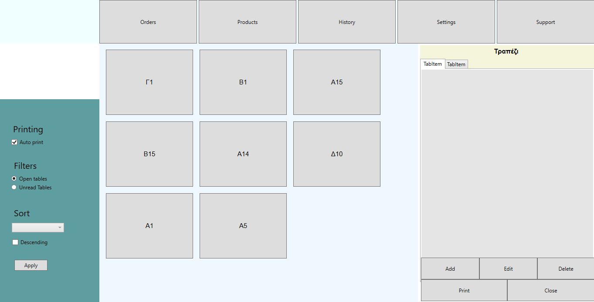

# RavaisiPDADesktop_WPF

## Description

This application serves as the kitchen interface for managing orders sent from the RavaisiPDA Android application. It is developed using WPF (Windows Presentation Foundation) and the .NET Framework version 4.7.2. The application communicates with a MySQL database hosted on an XAMPP server.

## Links

* Android Application: [RavaisiPDA Android App Repository](https://github.com/komoro13/RavaisiPDA)
* Desktop Application: [RavaisiPDADesktop WPF](https://github.com/komoro13/RavaisiPDADesktop_WPF)
* Old Desktop Application: [Ravaisi PDA Desktop (WinForms)](https://github.com/komoro13/Ravaisi_PDA_Desktop)
* Backend: [RavaisiPHP](https://github.com/komoro13/RavaisiPHP)

## Features

* **Order Management**: 
  * View, close, and print orders received from the waiters.
  
* **Product Management**: 
  * Add, delete, and manage products, categories, and toppings.
  
* **Order History**: 
  * View and manage past orders for reference.
  
* **Settings**: 
  * Change language, colors, and network settings.
  
* **Support**: 
  * Run diagnostics and send messages for assistance.

## Installation

### Prerequisites

* XAMPP Server with MySQL.
* PHP files for backend functionality (if applicable).
* .NET Framework version 4.7.2.
  
### Setup Instructions

1. **Clone the Repository**: 
   ```bash
   git clone https://github.com/komoro13/RavaisiPDADesktop_WPF.git
2. **Build the Project**:
Open the project in Visual Studio.
Ensure the MySQL database is set up correctly in your XAMPP server.
Build the project in Visual Studio to create the executable.
3. **Set Up the Application**:
Upon first launch, navigate to the Settings section within the application.
Specify the path to your XAMPP installation for proper database connectivity.

## Basic Functionality

### Orders page



 Main Window: The primary interface for managing orders. On the left is the Tables Canvas, displaying the buttons for each table. On the 
 right is the Order Canvas, featuring the TabControl that shows current orders and provides options to view, print, or close each order.

### Main loop

```c#
private bool checkForChanges()
{
    while (true)
    {
        if (checkForNewOrder())
        {
            System.Media.SoundPlayer player = new System.Media.SoundPlayer("bell.wav");
            player.Play();
            //MessageBox.Show("Νεα παραγγελια!");
            Dispatcher.Invoke(new Action(() => getOrders(current_sql_cmd)));
            Dispatcher.Invoke(new Action(() => showOrders()));
        }
        if (checkForLoadedOrders() && filter!=NEW_ORDERS)
        {
            Dispatcher.Invoke(new Action(() => getOrders(current_sql_cmd)));
            Dispatcher.Invoke(new Action(() => showOrders()));
        }
        if (checkForActiveOrders())
        {
            Dispatcher.Invoke(new Action(() => getOrders(current_sql_cmd)));
            Dispatcher.Invoke(new Action(() => showOrders()));
        }
    }

}
```
#### Explanation
* **Functionality:**
  * This method runs an infinite loop that checks for new orders, loaded orders, and active orders.
* **Notifications**:
  * When a new order is detected, it plays a notification sound to alert the kitchen staff.
* **Updating Orders**:
  * The method uses Dispatcher.Invoke to safely update the UI elements from the background thread, refreshing the orders displayed.
* **Conditions**:
  * The method checks for new orders, loaded orders, and active orders to ensure the interface reflects the current state of the kitchen.
This method is crucial for providing real-time updates and notifications to kitchen staff upon receiving new orders.
### Load orders
```c#
public void getOrders(string cmd)
{
    //This method gets all the orders as specified by the sql command
    //converts them from data rows to Order object and adds each order
    //to the Order ArrayList orders
    orders = new List<Order>();
    DataRow[] rows = OrdersSQLDatabase.getRowsArray(cmd);
    foreach (DataRow row in rows)
    {
        if (row["id"] == null)
            break;
        Order order = new Order(row["order_string"].ToString(), //order constructor
                                row["price"].ToString(),
                                row["id"].ToString(),
                                (Boolean)row["loaded"],
                                (Boolean)row["printed"],
                                row["order_index"].ToString(),
                                DateTime.Parse(row["date_time"].ToString()));

        orders.Add(order); //adding each order to the Order ArrayList orders
    }            
}
```
### Explanation
**Functionality**: This method retrieves orders from the database as order strings using the provided SQL command.
**Data Conversion**: Each order string is converted into an Order object, ensuring that all relevant details (like price and status) are included.
**Main Orders List Update**: The method adds each constructed order to the main list of Order objects for easy access and management of current orders.
**Database Structure**: For more information about the database structure and order serialization, please visit [RavaisiPHP](https://github.com/komoro13/RavaisiPHP)

## Usage
### Orders 
* The program displays the loaded orders in the main interface.
* Users can:
  * **Print an Order**: Select an order to print it out for the customer.
  * **Close an Order**: Mark the order as closed when the customers leave the table.
* **Filter Options**:
  * Show only unread orders or all orders for better management.
* **Sorting Options**:
  * Sort the orders by price, order size, or recent activity to find orders quickly.
### Products Management
* Users can add products, toppings, or categories.
  
#### Adding a Category
* To add a category, simply provide a name.

#### Adding a Product
* To add a product, you must specify:
  * Product Name
  * Price
  * Toppings that can be used for this product
  * Category the product belongs to

#### Adding a Topping
* To add a topping, you need to provide:
  * Topping Name
  * Extra Charge

## Contributing

Contributions are welcome! Here’s how you can help improve the project:

1. **Fork the Repository**: Create your own copy of the project on your GitHub account.
2. **Make Changes**: Implement your improvements or fixes in a new branch.
3. **Test Your Changes**: Ensure that everything works as expected.
4. **Submit a Pull Request**: Submit your changes back to the main repository with a description of what you have done.

### Guidelines

* Follow the project’s coding style.
* Write clear and descriptive commit messages.
* Ensure that your code is well-documented and includes comments where applicable.
